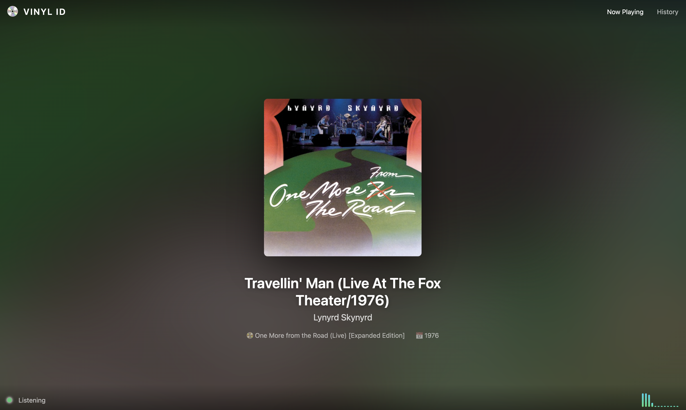
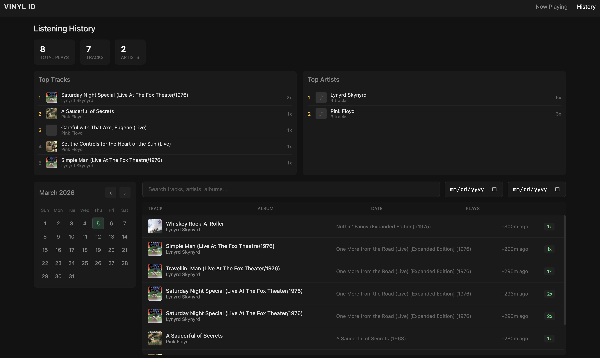

# Vinyl ID

A real-time vinyl record identifier that listens to your turntable and automatically identifies tracks using Shazam. Features a web-based dashboard to view what's currently playing and browse your listening history.



## Features

- **Real-time identification** - Continuously listens and identifies tracks every 15 seconds
- **Album art display** - Shows album artwork with dynamic background colors
- **Star/favorite system** - Star tracks you love directly from the Now Playing screen
- **Listening history** - Logs all identified tracks to a local database
- **Calendar view** - Browse history by date with an interactive calendar (color-coded by listen count)
- **Top charts** - See your most played tracks and artists
- **Search & filter** - Search your history by track, artist, or album; filter by starred tracks
- **Duplicate prevention** - Won't log the same track twice within 10 minutes
- **Touch-friendly** - Designed for Raspberry Pi with touchscreen
- **Config file system** - Easy setup for different environments (desktop, Pi line-in, Pi microphone)



## Quick Start (Desktop/Laptop)

```bash
git clone https://github.com/Connor-Tluck/vinyl_listener.git
cd vinyl_listener

# Install Python dependencies
pip install -r requirements.txt

# Start the app (uses config.yaml automatically)
python run.py

# Open in browser
open http://localhost:8080
```

## Raspberry Pi Installation

### Hardware Setup

**Option A: Line-in (Recommended)**
- USB audio interface with line-in (e.g., Behringer UCA202)
- RCA splitter cable
- Connect: Turntable -> Preamp -> RCA Splitter -> Speakers + USB Audio Interface -> Pi

**Option B: Microphone**
- USB microphone
- Position near speakers

### Software Setup

```bash
# 1. Update system
sudo apt update && sudo apt upgrade -y

# 2. Install system dependencies
sudo apt install -y python3-pip python3-venv portaudio19-dev libffi-dev

# 3. Optional: Install chromaprint for AcoustID fallback
sudo apt install -y libchromaprint-tools

# 4. Clone the repository
git clone https://github.com/Connor-Tluck/vinyl_listener.git
cd vinyl_listener

# 5. Create virtual environment
python3 -m venv venv
source venv/bin/activate

# 6. Install Python dependencies
pip install -r requirements.txt

# 7. Copy the Pi config template
cp config.pi.yaml config.yaml
# OR for microphone setup:
# cp config.microphone.yaml config.yaml

# 8. Find your audio device
python run.py --list-devices
# Note the name of your USB audio device (e.g., "USB Audio CODEC")

# 9. Edit config.yaml with your device name
nano config.yaml
# Change audio_device to match your device name

# 10. Start the app
python run.py

# 11. Open browser on Pi or another device on the network
# http://<pi-ip-address>:8080
```

### Auto-start on Boot (systemd)

```bash
# Create service file
sudo nano /etc/systemd/system/vinyl-id.service
```

Paste this content (adjust paths as needed):

```ini
[Unit]
Description=Vinyl ID
After=network.target

[Service]
Type=simple
User=pi
WorkingDirectory=/home/pi/vinyl_listener
ExecStart=/home/pi/vinyl_listener/venv/bin/python run.py
Restart=always
RestartSec=10

[Install]
WantedBy=multi-user.target
```

Enable and start:

```bash
sudo systemctl enable vinyl-id
sudo systemctl start vinyl-id

# Check status
sudo systemctl status vinyl-id

# View logs
journalctl -u vinyl-id -f
```

### Kiosk Mode (Fullscreen Browser)

For a dedicated display, run Chromium in kiosk mode:

```bash
# Install unclutter to hide cursor
sudo apt install -y unclutter

# Add to ~/.config/lxsession/LXDE-pi/autostart:
@unclutter -idle 0
@chromium-browser --kiosk --noerrdialogs --disable-infobars http://localhost:8080
```

## Desktop/Laptop Usage

```bash
# Start the app (loads config.yaml automatically)
python run.py

# Open in browser
open http://localhost:8080
```

## Command Line Options

```bash
python run.py --help

Options:
  --config FILE      Path to config file (default: config.yaml)
  --port PORT        Web server port (overrides config)
  --device DEVICE    Audio input device ID or name (overrides config)
  --interval SECS    Identification interval in seconds (overrides config)
  --pi-mode          Enable Pi/kiosk mode (fullscreen, larger touch targets)
  --list-devices     List available audio input devices
```

## Configuration

The app uses `config.yaml` for settings. Example configs are provided:

| File | Use Case |
|------|----------|
| `config.yaml` | Default (microphone, desktop) |
| `config.pi.yaml` | Raspberry Pi with USB line-in |
| `config.microphone.yaml` | Raspberry Pi with USB microphone |

### Config Options

```yaml
# Audio Settings
audio_mode: line_in      # "line_in" or "microphone"
audio_device: "USB Audio" # Device name or ID (null = default)
audio_gain: 1.0          # Gain adjustment (1.0 = no change)
silence_threshold: 0.001 # RMS level below which audio is silent

# Identification Settings
identification_interval: 15  # Seconds between identification attempts
sample_duration: 15          # Seconds of audio to sample
duplicate_window: 10         # Minutes before re-logging same track

# Web Server
port: 8080
host: 0.0.0.0

# Display Settings (for Pi/touchscreen)
pi_mode: false    # Enable Pi optimizations
fullscreen: false # Hide cursor, kiosk mode
touch_mode: false # Larger touch targets
```

### Line-in vs Microphone

**Line-in** (recommended for best results):
- Connect turntable to preamp, then split output to speakers and USB audio interface
- Cleaner signal = better identification accuracy
- Use lower gain (0.5-1.0) and lower silence threshold (0.001)

**Microphone**:
- Pick up audio from speakers via USB microphone
- Easier setup, no cable splitters needed
- May need higher gain (1.5-3.0) and higher silence threshold (0.005) to filter room noise

## How It Works

1. Captures audio continuously from your microphone or line-in
2. Every 15 seconds, samples the audio and sends it to Shazam for identification
3. If Shazam fails, falls back to AcoustID (MusicBrainz database)
4. Logs identified tracks to a local SQLite database
5. Displays results in a web dashboard with album art

## Project Structure

```
vinyl-id/
├── run.py              # Main entry point - starts web server and listener
├── app.py              # Flask web application
├── identifier.py       # Shazam + AcoustID identification
├── database.py         # SQLite database operations
├── vinyl_listener.py   # CLI-only listener (standalone)
├── config.yaml         # Configuration file
├── config.pi.yaml      # Example config for Pi with line-in
├── config.microphone.yaml  # Example config for microphone setup
├── templates/
│   ├── index.html      # Now Playing page
│   └── history.html    # Listening History page
├── vinyl_history.db    # SQLite database (created on first run)
└── requirements.txt    # Python dependencies
```

## Requirements

- Python 3.10+
- Working microphone or audio input
- Internet connection (for Shazam API)

## Cost

**$0/month** - All APIs used are free:
- Shazam (via shazamio) - Free
- AcoustID/MusicBrainz - Free
- SQLite - Local storage

## Star System

You can star/favorite tracks to mark ones you love:

- **Now Playing page** - Tap the star button next to the track title to favorite it
- **History page** - Click the star icon on any row to toggle it
- **Filter starred** - Click the "Starred" button to show only your favorited tracks

Starred tracks are stored in the database and persist across sessions. This is useful for:
- Marking standout tracks while listening
- Building a list of favorites to revisit
- Filtering your history to see only the tracks you loved

## Database

Listening history is stored locally in `vinyl_history.db`. Back it up by copying the file:

```bash
cp vinyl_history.db vinyl_history_backup.db
```

## Troubleshooting

**No audio devices found:**
```bash
# Check if portaudio is installed
# macOS:
brew install portaudio

# Linux/Pi:
sudo apt install portaudio19-dev
pip uninstall sounddevice && pip install sounddevice
```

**Shazam not identifying tracks:**
- Ensure good audio quality (line-in preferred over microphone)
- Check audio levels aren't too quiet or clipping
- Try increasing `audio_gain` in config if signal is weak

**"Couldn't find ffmpeg" warning:**
- This is optional, only needed for some audio processing
- Install with: `brew install ffmpeg` (macOS) or `sudo apt install ffmpeg` (Linux)

**Pi touchscreen not responding:**
- Ensure `touch_mode: true` in config.yaml
- Check touchscreen drivers are installed
